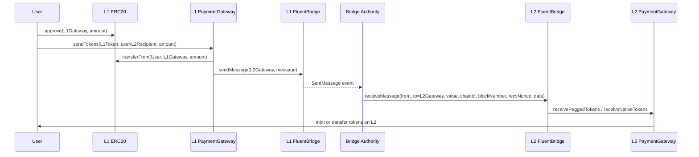
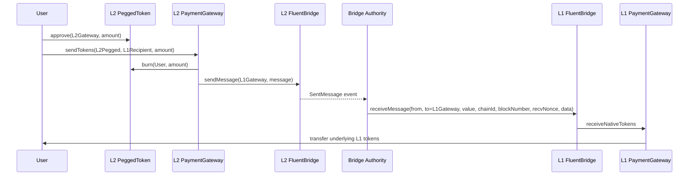

# Bridge Contracts

This repository contains the Fluent bridge, gateway, factory, token, verifier, oracle, and rollup contracts used to move messages and assets between L1 and L2.

## Overview

The main production surface is:

- `contracts/FluentBridge.sol`: cross-chain message transport, native-value custody, relayer delivery, proof-based withdrawals, and rollback handling.
- `contracts/gateways/PaymentGateway.sol`: native/ERC20 bridging built on top of `FluentBridge`.
- `contracts/factories/*.sol`: deterministic pegged-token deployment and beacon management.
- `contracts/tokens/*.sol`: bridged token implementations.
- `contracts/rollup/*.sol`: batch submission, preconfirmation, challenge resolution, finalization, and corruption handling.
- `contracts/verifier/*.sol` and `contracts/oracle/L1BlockOracle.sol`: verifier and oracle trust anchors.

## Security Docs

- `docs/SecurityModel.md`: trust boundaries, privileged roles, and protocol invariants.
- `docs/UpgradeSafety.md`: deployment and upgrade procedure expectations.
- `docs/Addresses.md`: currently tracked public deployment addresses.

## User Flows

### Deposit (L1 → L2)



### Withdrawal (L2 → L1)



> In rollup mode, L2 -> L1 withdrawals can alternatively be proven via `receiveMessageWithProof` using finalized rollup batches and Merkle proofs instead of the trusted relayer path.

## Prerequisites

Make sure you have the following installed:

- Node.js (`>=16.x.x`) and npm
- Foundry (`forge`, `cast`, `anvil`)
- Solidity compiler compatible with the above contracts

## Installation

Clone the repository and install dependencies:

```bash
git clone https://github.com/<your-repo>/bridge-contracts.git
cd bridge-contracts
forge install
```

## Testing

Run the active test suite with Foundry:

```bash
forge test
```

Useful commands:

```bash
forge build
forge fmt
anvil --port 8545
anvil --port 8546
```

## Test Layout

- `test/Rollup`: active rollup lifecycle and admin coverage.
- `test/Bridge`: active message-delivery, timeout, and relayer funding coverage.
- `test/Gateway`: active token/native bridge coverage.
- `test/Invariant`: active invariant coverage for bridge/gateway interactions.
- `test-old`: archived parity/e2e/invariant suites kept for reference while coverage is migrated into the active tree.

## Operational Notes

- `foundry.toml` enables `build_info`, `ast`, and `storageLayout` outputs for upgrade review.
- Some deployment and upgrade scripts still rely on unsafe upgrade helpers. They now require `ALLOW_UNSAFE_UPGRADES=true` so unsafe execution is always explicit.
- `scripts/deploy/SetupBridge.s.sol` uses FFI and external `cast send` calls, so deployment operators should treat it as a privileged operational script rather than pure Solidity logic.