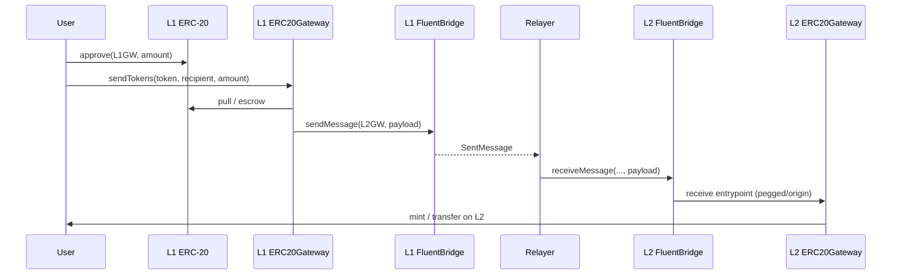

# Solidity contracts — Fluent bridge, gateways, and rollup

## 1. Overview

### What this repository is

Solidity contracts for **moving messages and value between Ethereum (L1) and Fluent (L2)**. The stack includes:

- A **core bridge** (`FluentBridge` + L1/L2 implementations) for enqueueing, delivering, and optionally proving cross-chain messages.
- **Gateways** (`ERC20Gateway`, `NativeGateway`) that encode token/native flows as bridge messages.
- **Factories** and **pegged tokens** for deterministic L2 representations of L1 ERC-20s.
- A **rollup** contract for batch lifecycle, challenges, and finalization, wired to the L1 bridge for proof-based paths.
- **Verifiers** and **L1 oracles** used by the rollup and L2 bridge timing/fee logic.

### Why it exists

Fluent runs as an L2. These contracts define **how assets and calldata cross the boundary**: custody on the source chain, delivery on the destination chain, and (on L1) an alternative path that uses **rollup state commitments and Merkle proofs** instead of a trusted relayer for some withdrawals.

### Key concepts (short)

| Concept | Meaning |
|--------|---------|
| **FluentBridge** | Abstract bridge: `sendMessage`, trusted `receiveMessage`, proof-based `receiveMessageWithProof` (L1), rollback/retry hooks. Concrete deployments are `L1FluentBridge` and `L2FluentBridge`. |
| **Other bridge** | Each bridge stores the peer contract address on the remote chain; messages are logically “from” that peer when delivered. |
| **Relayer / `RELAYER_ROLE`** | Account allowed to call trusted delivery on the destination chain. This is **trusted execution** (must supply `msg.value` equal to the message value for native payout). |
| **Gateway** | User-facing contract that escrows/burns tokens (or locks native ETH), then calls `FluentBridge.sendMessage` with an ABI-encoded payload for the remote gateway. |
| **Factory** | Deploys or resolves pegged token addresses; only the configured gateway (or owner) may trigger deploys. |
| **Rollup** | Optimistic rollup with Nitro preconfirmation and SP1-style proof resolution; ties into L1 bridge queues and proof verification. |

---

## 2. Architecture

### Main components (by directory)

- **`contracts/bridge/`** — `FluentBridge.sol` (abstract), `L1FluentBridge.sol`, `L2FluentBridge.sol`, storage layout.
- **`contracts/gateways/`** — `GatewayBase.sol`, `ERC20Gateway.sol`, `NativeGateway.sol`.
- **`contracts/factories/`** — `GenericTokenFactory.sol`, `ERC20TokenFactory.sol`, `UniversalTokenFactory.sol`.
- **`contracts/tokens/`** — `ERC20PeggedToken.sol` (beacon proxies on L2).
- **`contracts/rollup/`** — `Rollup.sol`, storage layout.
- **`contracts/verifier/`** — e.g. `NitroVerifier.sol`.
- **`contracts/oracles/`** — `L1BlockOracle.sol`, `L1GasOracle.sol` (L2 bridge fee/oracle inputs).

### How they interact

1. **User → gateway (source chain)**  
   Approves/transfers tokens or sends ETH; gateway calls **`FluentBridge.sendMessage(remoteGateway, payload)`** (plus fees). Native value intended for the remote side is locked in the bridge (minus any outbound fee).

2. **Bridge (source)**  
   Emits **`SentMessage`** (includes nonce, chain id, block number, hash, calldata). On L1 with rollup configured, outbound messages can also be recorded for later proving.

3. **Delivery (destination)**  
   - **Trusted path:** `RELAYER_ROLE` calls **`receiveMessage(...)`** with correct ordering (`receivedNonce`) and **`msg.value == value`** when the message carries native value.  
   - **Trust-minimized path (L2 → L1):** anyone (subject to proof checks) may call **`receiveMessageWithProof`** using finalized rollup data and Merkle proofs.

4. **Gateway (destination)**  
   Bridge calls **`receivePeggedTokens` / `receiveOriginTokens` / `receiveNativeTokens`** (depending on flow); gateway mints/unlocks/transfers to the end user.

### Data and execution flow (ERC-20 deposit)



**Withdrawal** is the reverse: burn or escrow on L2, message to L1 gateway, unlock or release on L1. For rollup deployments, L2→L1 can use **`receiveMessageWithProof`** instead of the relayer (see interface and `Rollup` integration).

### Further reading

- **`docs/BridgeFailuresAndRollback.md`** — failed delivery, L2 deadline, `receiveFailedMessage`, L1 proof rollback (with diagrams).
- **`docs/SecurityModel.md`** — roles, trust assumptions, invariants.
- **`docs/UpgradeSafety.md`** — proxy/beacon upgrades, unsafe scripts, checklists.
- **`docs/Addresses.md`** — tracked deployment addresses.

---

## 3. Setup

### Prerequisites

- **[Foundry](https://book.getfoundry.sh/getting-started/installation)** (`forge`, `cast`, `anvil`). The repo pins **Solidity 0.8.30** in `foundry.toml`; you do not install `solc` separately if `forge` manages it.
- **Git** (submodules under `lib/`).

*(This repo does not use npm/package.json; Node.js is not required for build or tests.)*

### Step 1 — Clone

```bash
git clone https://github.com/fluentlabs-xyz/solidity-contracts.git
cd solidity-contracts
```

### Step 2 — Install dependencies

```bash
forge install
```

**Expected:** `lib/` contains dependencies such as `forge-std`, `openzeppelin-contracts`, `openzeppelin-contracts-upgradeable`, `openzeppelin-foundry-upgrades`. If `lib/` is missing or empty, `forge build` will fail until `forge install` succeeds.

### Step 3 — Build

```bash
forge build
```

**Expected:** Compiles without errors; artifacts under `forge-out/`.

### Step 4 — Test

```bash
forge test
```

**Expected (example):** All active suites pass, e.g. a summary line like:

`Ran N test suites in …: … tests passed, 0 failed, … skipped`

*(Exact counts change as tests are added; skipped tests may appear if some suites are gated.)*

### Optional — Local nodes

```bash
anvil --port 8545
anvil --port 8546
```

Useful for forked or multi-chain scripting; not required for `forge test`.

### Configuration notes (`foundry.toml`)

- **`via_ir = true`**, **Cancun** EVM, **optimizer** on.
- **`extra_output` / `ast` / `build_info`** — intended for upgrade reviews and storage layout tooling.
- **`ffi = true`** and **`fs_permissions`** — required for some **deployment** scripts that read/write `deployments/` and `config/`.

---

## 4. Usage examples

### Format

Forge scripts use **`vm.startBroadcast()`** — you supply a private key or keystore via Foundry’s usual flags (e.g. `--private-key`, `--ledger`, `--broadcast`).

### ERC-20 deposit (initiate L1 → L2)

**Script:** `scripts/user_flows/DepositTokens.s.sol`

**Environment variables:**

| Variable | Role |
|----------|------|
| `GATEWAY_ADDRESS` | `ERC20Gateway` proxy on the source chain |
| `TOKEN_ADDRESS` | Origin ERC-20 |
| `RECIPIENT` | Address on the destination chain |
| `AMOUNT` | Amount in token units (`> 0`) |

**Command (shape):**

```bash
forge script scripts/user_flows/DepositTokens.s.sol:DepositTokens \
  --rpc-url "$RPC_URL" \
  --broadcast
```

**On-chain effect:** `approve` then `ERC20Gateway.sendTokens` → bridge `sendMessage` → `SentMessage` on source; a relayer (or proof path) must complete delivery on the destination.

### Native bridge (shape)

**Script:** `scripts/user_flows/SendAndReceiveNative.s.sol` (and related `sendNative.s.sol`, `ReceiveNative.s.sol`)

Set addresses per the script header comments (bridge/gateway on L1/L2). These scripts mirror the operational flow used in tests; read each file’s `@dev Environment` block for exact env var names.

### Low-level relayer debugging

**Script:** `scripts/user_flows/ReceiveTokens.s.sol`  
Calls **`FluentBridge.receiveMessage`** with explicit `(from, to, value, chainId, blockNumber, nonce, message)` — for **operators** who already have the encoded fields from `SentMessage`. Requires the bridge to hold enough ETH if `VALUE_WEI > 0`.

### Cast — read configuration

```bash
cast call "$BRIDGE" "getOtherBridge()(address)" --rpc-url "$RPC"
cast call "$BRIDGE" "getSentMessageFee()(uint256)" --rpc-url "$RPC"
```

**Output:** ABI-decoded return values; use to verify wiring before sending real funds.

---

## 5. Developer guide

### Extending the system

- **New asset type:** Prefer a dedicated gateway that inherits **`GatewayBase`**, enforces **`onlyFluentBridge`** on receive paths, and encodes a fixed **remote selector** payload (same pattern as `NativeGateway` / `ERC20Gateway`).
- **New message path on the bridge:** Subclassing **`FluentBridge`** directly is rarely needed; L1/L2 differences live in **`L1FluentBridge`** / **`L2FluentBridge`**. Coordinate storage layout via **`FluentBridgeStorageLayout`** and run storage diffs before upgrades.
- **Tests:** Add suites under `test/Bridge`, `test/Gateway`, `test/Rollup`, etc., following existing **`Base.t.sol`** patterns.

### Design decisions worth remembering

- **Sequential nonces on receive:** Trusted delivery enforces ordering; gaps block progress until the missing nonce is delivered.
- **Native value:** Relayer (or proof path caller) must provide **`msg.value == value`** for messages that carry ETH; the bridge does not mint ETH on L1.
- **L2 deadlines:** **`L2FluentBridge`** uses **`L1BlockOracle`** (and related config) for receive deadlines; a stale oracle breaks timeout semantics (see security doc).
- **Upgradeable contracts:** UUPS proxies + beacon for pegged tokens; **`foundry.toml`** enables **`storageLayout`** output for diffing.

### Naming: “PaymentGateway” in scripts and docs

Deploy helpers (e.g. **`DeployLib._deployPaymentGateway`**) deploy **`ERC20Gateway`** behind a UUPS proxy. Factories still use **`setPaymentGateway`** for the authorized gateway address. **`docs/SecurityModel.md`** may say “PaymentGateway”; the implementation file is **`contracts/gateways/ERC20Gateway.sol`**.

### Gotchas / edge cases

- **`receiveMessage` after deadline:** Can mark a message failed without executing the target; operators may use **`receiveFailedMessage`** after fixing downstream state (relayer-only).
- **Self-call / forbidden destinations:** `sendMessage` must not target this bridge or **`otherBridge`**.
- **Paused bridge:** Sends and receives respect **`Pausable`**; all user flows stop while paused.
- **Scripts with `ALLOW_UNSAFE_UPGRADES`:** Some deploy/upgrade paths require **`ALLOW_UNSAFE_UPGRADES=true`** so unsafe OpenZeppelin upgrade helpers are never accidental (see **`docs/UpgradeSafety.md`**).
- **`SetupBridge.s.sol`:** Uses **FFI** and external tooling patterns — treat as **operational** infrastructure, not on-chain logic to replicate in contracts.

---

## 6. Troubleshooting

| Symptom | Likely cause | What to do |
|--------|----------------|------------|
| `forge build` / `forge test`: missing imports or `@openzeppelin` errors | Submodules not installed | Run `forge install` from repo root; confirm `lib/openzeppelin-contracts` exists. |
| `InsufficientFee()` on `sendMessage` | `msg.value` below **`getSentMessageFee()`** | Increase `msg.value`; on native flows remember fee is deducted before locked “amount”. |
| `MessageReceivedOutOfOrder()` | Relayer delivered nonces out of sequence | Replay or deliver the expected **`receivedNonce`** next; inspect `SentMessage` ordering on source. |
| `MessageAlreadyReceived()` | Duplicate delivery or replay | Do not re-submit same hash; check off-chain idempotency. |
| Target call fails / `Failed` status | Calldata, gas, or destination contract reverts | Fix gateway/token state; use **`receiveFailedMessage`** only when bridge marked the message failed. |
| Deployment script reverts without clear ABI error | **`ALLOW_UNSAFE_UPGRADES`** not set where required | Set env var explicitly as documented in **`UpgradeSafety.md`** for those scripts only. |
| L2 receive / timeout oddities | **`L1BlockOracle`** stale or misconfigured | Verify oracle updater pipeline and admin-configured deadline. |

---

## 7. Test layout

- **`test/Rollup/`** — batch lifecycle, admin, challenges, corruption paths.
- **`test/Bridge/`** — message delivery, admin, L1/L2 bridge behavior.
- **`test/Gateway/`** — ERC-20 and native gateway flows.
- **`test/Invariant/`** — bridge/gateway invariants.
- **`test-old/`** — archived suites kept for reference while coverage migrates.

```bash
forge test --match-path test/Bridge
forge fmt
```

---

## 8. Assumptions (documentation)

- **Remote URL** for clone is taken from this repo’s `origin` (`fluentlabs-xyz/solidity-contracts`); if you fork, change the URL.
- **`docs/UpgradeSafety.md`** references **`UpgradePaymentGateway.s.sol`**; the **`scripts/upgrade/`** tree in this repo may only list **`UpgradeFluentBridge.s.sol`** and **`UpgradeERC20Beacon.s.sol`** — treat the security doc as the procedure source and align script names with your branch.
- **Universal token** behavior is referenced in interfaces/factories; not all token implementations may live under **`contracts/tokens/`** in this checkout.
