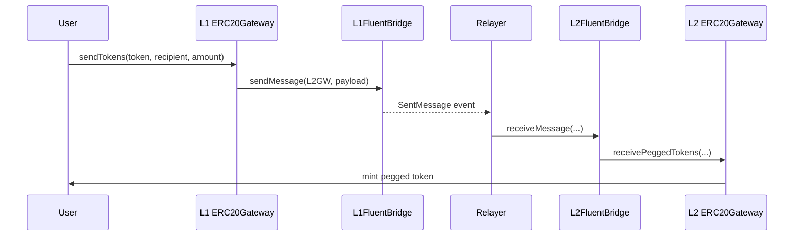

# Fluent Bridge Contracts

Fluent is a Layer 2 blockchain that settles on Ethereum. This repository contains the Solidity contracts for cross-chain communication between Ethereum (L1) and Fluent (L2): a general-purpose message bridge, ERC-20 and native ETH gateways built on top of it, and an L1 rollup contract that enables trustless withdrawal verification via Merkle proofs.

## 1. Architecture

### Contract structure

| Directory | Contracts | Purpose |
|-----------|-----------|---------|
| `contracts/bridge/` | `FluentBridge` (abstract), `L1FluentBridge`, `L2FluentBridge`, storage layout | Cross-chain message transport: send, receive (relayer), receive-with-proof (L1), rollback, retry |
| `contracts/gateways/` | `GatewayBase` (abstract), `ERC20Gateway`, `NativeGateway` | User-facing asset entrypoints. Lock/escrow on source, mint/release on destination |
| `contracts/factories/` | `GenericTokenFactory`, `ERC20TokenFactory`, `UniversalTokenFactory` | Deterministic CREATE2 deployment of pegged tokens on the destination chain |
| `contracts/tokens/` | `ERC20PeggedToken` | Beacon-proxied pegged ERC-20 representation on L2 |
| `contracts/rollup/` | `Rollup`, `RollupStorageLayout` | L1 rollup: batch lifecycle, challenges, finalization, bridge deposit consumption |
| `contracts/verifier/` | `NitroVerifier` | Nitro enclave signature verification |
| `contracts/oracles/` | `L1BlockOracle`, `L1GasOracle` | L2-side oracles for L1 block number (deadline enforcement) and gas price (fee calculation) |
| `contracts/libraries/` | `Heap`, `Queue`, `MerkleTree`, `ExcessivelySafeCall` | Min-heap (challenge queue), FIFO (sent messages), Merkle proofs, safe external calls |

All contracts use **UUPS proxy** pattern with **ERC-7201 namespaced storage**. Interfaces in `contracts/interfaces/` are the source of truth for function signatures, errors, and events.

### Message lifecycle

**L1 → L2 deposit (ERC-20 example):**

1. User calls `ERC20Gateway.sendTokens(token, recipient, amount)` with `msg.value` covering the bridge fee.
2. Gateway escrows the origin token and calls `FluentBridge.sendMessage(remoteGateway, payload)`.
3. Bridge emits `SentMessage` (sender, to, value, chainId, blockNumber, nonce, messageHash, data). On L1 with rollup configured, the message is also enqueued for later proving.
4. Off-chain relayer picks up the event and calls `L2FluentBridge.receiveMessage(...)` with the same parameters and matching `msg.value`.
5. L2 bridge delivers the payload to the remote `ERC20Gateway`, which mints a pegged token to the recipient.



**L2 → L1 withdrawal** is the reverse: burn pegged token on L2, message to L1 gateway, release escrowed token on L1. Two delivery paths exist on L1:

- **Trusted path:** Relayer calls `L1FluentBridge.receiveMessage(...)` (same as deposit, but L1-bound).
- **Proof path:** Anyone calls `L1FluentBridge.receiveMessageWithProof(batchIndex, blockHeader, ..., withdrawalProof, blockProof)` using finalized rollup data and Merkle proofs — no relayer trust required.

**Native ETH bridging** follows the same pattern via `NativeGateway.sendNativeTokens(recipient)` with `msg.value` as the bridged amount.

**Failure and rollback:** If delivery fails (target reverts, L2 deadline exceeded), the message is marked `Failed`. It can be retried via `receiveFailedMessage`, or on L1 the sender can be refunded via `rollbackMessageWithProof`. See [`docs/BridgeFailuresAndRollback.md`](docs/BridgeFailuresAndRollback.md) for the full lifecycle with state diagrams.

### Rollup batch lifecycle

The L1 `Rollup` contract manages batch progression:

```
None → HeadersSubmitted → Accepted → Preconfirmed → Finalized
                                      ↕ Challenged
```

| Step | Who | What happens |
|------|-----|-------------|
| `acceptNextBatch` | `SEQUENCER_ROLE` | Submits L2 block headers for the next batch |
| `submitBlobs` | `SEQUENCER_ROLE` | Provides EIP-4844 blob hashes for the accepted batch |
| `preconfirmBatch` | `PRECONFIRMATION_ROLE` | Nitro enclave signature verifies batch integrity |
| `finalizeBatches` | Anyone | Permissionless after `finalizationDelay` L1 blocks |
| `finalizeWithProofs` | `PROVER_ROLE` | Immediate finalization if all blocks have SP1 proofs |
| `challengeBlock` | `CHALLENGER_ROLE` | Disputes a specific block; requires ETH deposit |

Two deadline mechanisms protect liveness:

- **`submitBlobsWindow`** — max L1 blocks for blob submission after header acceptance (0 = disabled)
- **`challengeWindow`** — L1 blocks a prover has to resolve a challenge

Exceeding any active deadline triggers the **corrupted** state. All state-changing functions revert until the corrupted batch is cleared via `forceRevertBatch` (`EMERGENCY_ROLE`).

### Verification paths

- **Batch preconfirmation:** `NitroVerifier.verifyBatch()` — ECDSA recovery against whitelisted Nitro enclave public keys.
- **Challenge resolution:** `SP1Verifier.verifyProof()` — ZK proof of block execution.
- **Enclave attestation:** SP1 ZK proof validates the Nitro certificate chain; verified public key is added to the whitelist.
- **VKEY rotation:** `updateProgramVKey` is permissioned to `DEFAULT_ADMIN_ROLE`; the admin is expected to be an OZ `TimelockController` so the rotation is observable off-chain before it takes effect.

---

## 2. Actors and roles

| Contract | Role | Capabilities |
|----------|------|-------------|
| **FluentBridge** | `DEFAULT_ADMIN_ROLE` | Authorize UUPS upgrades; configure `otherBridge`, `rollup`, `l1BlockOracle`, `receiveMessageDeadline` |
| | `PAUSER_ROLE` | Pause/unpause message sends and receives |
| | `RELAYER_ROLE` | Execute trusted message delivery; retry failed messages |
| **Rollup** | `DEFAULT_ADMIN_ROLE` | Authorize UUPS upgrades; rotate bridge/verifier addresses and timing parameters |
| | `SEQUENCER_ROLE` | Submit batch headers and blob hashes |
| | `PRECONFIRMATION_ROLE` | Preconfirm batches via Nitro verification |
| | `CHALLENGER_ROLE` | Open disputes and lock challenge deposits |
| | `PROVER_ROLE` | Resolve challenges and claim proof rewards |
| | `EMERGENCY_ROLE` | Pause/unpause; force-revert corrupted batches |
| **Gateways** | `owner()` | Authorize UUPS upgrades; configure bridge/factory routing and token mappings |
| **Factories** | `owner()` | Rotate gateway address; upgrade beacon (ERC20 factory) |
| **NitroVerifier** | `DEFAULT_ADMIN_ROLE` | Manage enclave public keys and VKEY |

For full trust assumptions, invariants, and operator notes, see [`docs/SecurityModel.md`](docs/SecurityModel.md).

---

## 3. Build, test, and coverage

### Prerequisites

- **[Foundry](https://book.getfoundry.sh/getting-started/installation)** (`forge`, `cast`, `anvil`). The repo pins **Solidity 0.8.30** in `foundry.toml`.

Node.js is not required.

### Setup

```bash
git clone https://github.com/fluentlabs-xyz/solidity-contracts.git
cd solidity-contracts
forge install
```

### Build

```bash
forge build
```

Compiles without errors; artifacts under `out/`. Configuration: `via_ir = true`, Prague EVM, optimizer on (200 runs).

### Test

```bash
forge test
```

All active suites pass. Some suites require external RPC endpoints and are skipped when unavailable.

Run a specific test file or directory:

```bash
forge test --match-path test/Rollup/AcceptBatch.t.sol
forge test --match-path "test/Bridge/*"
```

### Coverage

```bash
forge coverage --ir-minimum
```

The `--ir-minimum` flag is required because the project compiles with `via_ir = true`. `ExcessivelySafeCall` is excluded via `no_match_coverage` in `foundry.toml` because Forge cannot instrument inline assembly.

For an LCOV report:

```bash
forge coverage --ir-minimum --report lcov
```

### Test layout

| Directory | What it covers |
|-----------|---------------|
| `test/Rollup/` | Batch lifecycle, admin, challenges, corruption, deposits, emergency, finalization (12 test files) |
| `test/Bridge/` | Message delivery, admin, pausing, L1/L2 bridge variants (6 test files) |
| `test/Gateway/` | ERC-20 and native gateway send/receive flows (3 test files) |
| `test/Base/` | End-to-end integration flows for ERC-20 and native bridging (4 test files) |
| `test/Invariant/` | Stateful invariant testing for bridge/gateway (1 test + handler) |
| `test/Verifier/` | Nitro verifier tests (1 test file) |
| `test/Oracle/` | L1BlockOracle and L1GasOracle (2 test files) |
| `test/libraries/` | Heap, Queue, MerkleTree, ExcessivelySafeCall (4 test files) |
| `test/factories/` | ERC20TokenFactory (1 test file) |
| `test/tokens/` | ERC20PeggedToken (1 test file) |
| `test/mocks/` | 7 mock contracts used across test suites |
| `test/helpers/` | Shared test utilities (WithdrawalMerkle) |

---

## 4. Documentation

| Document | What it covers |
|----------|---------------|
| **[`docs/SecurityModel.md`](docs/SecurityModel.md)** | Contract topology, all privileged roles and capabilities, trust assumptions, core invariants, high-trust operations. **Start here for the full actor/role map.** |
| **[`docs/BridgeFailuresAndRollback.md`](docs/BridgeFailuresAndRollback.md)** | Complete message lifecycle with state diagrams: trusted delivery, L2 timeout mechanics, target execution failure, retry via `receiveFailedMessage`, L1 proof-based rollback. |
| **[`docs/UpgradeSafety.md`](docs/UpgradeSafety.md)** | All UUPS proxy and beacon upgrade surfaces, required 6-step upgrade procedure, unsafe scripts, deployment checks, auditor evidence checklist. |
| **[`docs/Addresses.md`](docs/Addresses.md)** | Deployed contract addresses for Sepolia (L1) and Fluent testnet (L2), chain IDs, RPC endpoints, explorer links, verification instructions. |
| **[`docs/DeveloperGuide.md`](docs/DeveloperGuide.md)** | Usage examples (deposit/withdraw scripts), extending the system (new gateways, message paths), troubleshooting common errors. |

---

## 5. Design constraints and known risks

- **No nonce skip or reset.** Trusted delivery (`receiveMessage`) enforces strict sequential nonces with no admin override. If the relayer loses nonce N, the trusted path is blocked until nonce N is delivered. **Mitigation:** on L1, the proof path (`receiveMessageWithProof`) is nonce-independent and serves as fallback. On L2, recovery depends on relayer availability.

- **Bridge pays value from its own balance.** On the trusted path, the relayer calls `receiveMessage` and the bridge forwards the message's `value` to the target — there is no explicit `msg.value == value` check. On the proof path (`receiveMessageWithProof`, `rollbackMessageWithProof`), the caller sends zero ETH and the bridge pays from locked funds. The bridge does not mint ETH; it only releases funds previously locked via `sendMessage`.

- **Admin actions are timelocked at the infrastructure level.** The contracts themselves do not embed a timelock — all privileged roles (`DEFAULT_ADMIN_ROLE`, `PAUSER_ROLE`, etc.) are held by an OpenZeppelin `TimelockController` in production. This means parameter changes (`receiveMessageDeadline`, `l1BlockOracle`, `rollup`, `otherBridge`, etc.) are subject to the timelock's minimum delay before execution. The timelock contract is external to the bridge and rollup; it is not visible in the Solidity source but is enforced at the deployment/configuration layer.

- **Nonce consumed before deadline check.** In `receiveMessage()`, `_takeNextReceivedNonce()` runs before `_beforeReceiveMessage()` (the L2 deadline hook). If the deadline is expired, the nonce is already consumed and the message is marked `Failed`. Retry happens via `receiveFailedMessage` on the same consumed nonce — no new nonce is spent.

- **Rollback transfers ETH only; `message` calldata is intentionally dropped.**
  `_receiveMessage` forwards `message` to `to` — a contract that explicitly opted into the bridge
  protocol and was designed to handle the encoded calldata. `_rollbackMessage` calls `from` (the
  original sender), which was never designed as a message receiver. Forwarding the same calldata to
  `from` would execute arbitrary logic on an unprepared contract, creating an uncontrolled external
  call and a potential reentrancy vector. This is why rollback uses empty calldata and transfers ETH
  only. As a consequence, ERC-20 or other non-native asset rollback is not handled by the bridge
  itself — it is the responsibility of a protocol-layer wrapper that locks assets on send and exposes
  a dedicated `claimRollback(messageHash)` function checking status via `getRollbackMessage()`.

---

## 6. License

Apache-2.0
