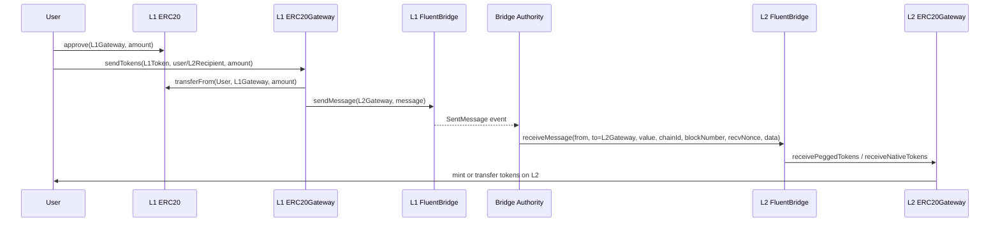

# Bridge Contracts

This project provides a suite of smart contracts and accompanying tests for implementing blockchain bridge functionality and rollup mechanics. The contracts are designed to ensure secure and efficient interoperability between blockchain networks.

## Table of Contents

- [Overview](#overview)
- [Contracts](#contracts)
- [Features](#features)
- [Installation](#installation)
- [Testing](#testing)

---

## Overview

The **Bridge Contracts** project focuses on bridging assets and data across blockchains as well as supporting rollup verifications. It includes modules for managing ERC20 token transfers, performing proof verifications, and deploying rollups to improve transaction scalability and network efficiency.

The project uses Solidity for smart contracts and Foundry for building and testing.

## Contracts

### Core Contracts
1. **Bridge.sol**
    - Manages the bridging functionality and facilitates cross-chain interoperability.

2. **ERC20Gateway.sol**
    - Handles the process of transferring ERC20 tokens across chains.

### Rollup Contracts
1. **Groth16Verifier.sol**
    - Implements the Groth16 zk-SNARK verifier for proof validation in rollups.

2. **SP1VerifierGroth16.sol**
    - Implements special proof logic for a specific verifier using Groth16.

3. **RLPReader.sol**
    - Provides functionality to parse RLP-encoded data, often used in rollups.

4. **Rollup.sol**
    - Core rollup contract responsible for enabling scalable transaction processing.

## Features

- **Cross-Chain Token Transfers**: Enables transferring tokens between blockchain networks.
- **Zk-Rollup Support**: Incorporates Groth16 zk-SNARKs for efficient proof verifications.
- **Modular Design**: Designed with modularity in mind to extend or customize bridge functionalities.

## User Flows (Sequence)

### Deposit (L1 → L2)



### Withdrawal (L2 → L1)


> **Note:** In rollup mode, L2 → L1 withdrawals can alternatively be proven via `receiveMessageWithProof` using rollup batches and Merkle proofs instead of the trusted relayer path.

## Prerequisites

Make sure you have the following installed:

- Node.js (`>=16.x.x`) and npm
- Foundry (`forge`, `cast`, `anvil`)
- Solidity compiler compatible with the above contracts

## Installation

Clone the repository and install dependencies:

```bash
git clone https://github.com/<your-repo>/bridge-contracts.git
cd bridge-contracts
yarn install
```

## Testing

Run the test suite with Foundry:

```bash
forge test
```

Useful commands:

```bash
forge build
forge fmt
anvil --port 8545
anvil --port 8546
```

### Testing Files

Tests are organized under `test/**/*.t.sol` (unit, invariant, and e2e parity suites).