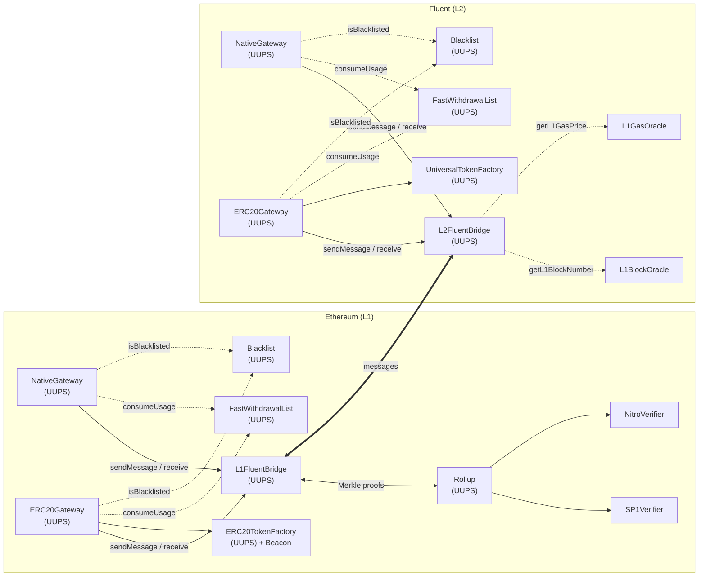
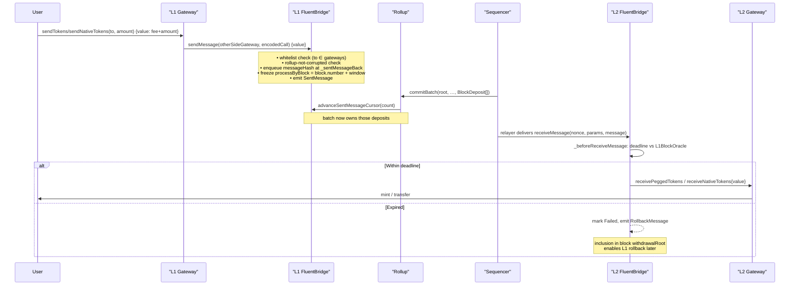
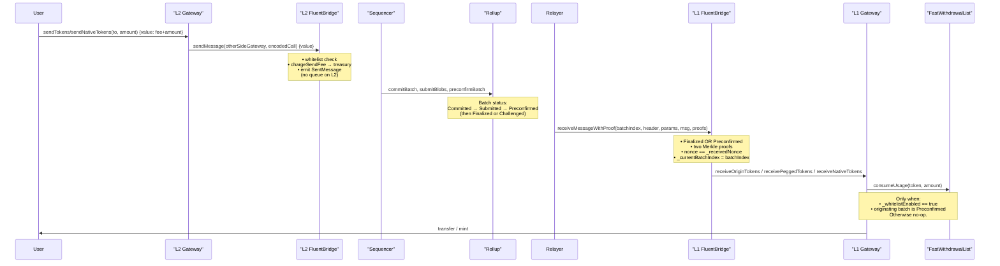
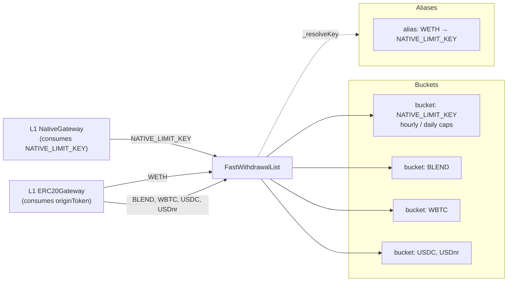
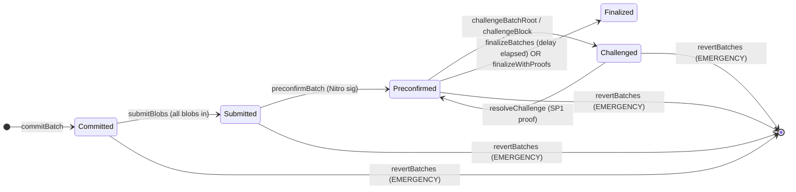

# Fluent Bridge Architecture

This document describes how the Fluent bridge moves value and messages between
Ethereum (L1) and the Fluent rollup (L2). It complements:

- [`SecurityModel.md`](./SecurityModel.md) — roles, trust assumptions, invariants.
- [`BridgeFailuresAndRollback.md`](./BridgeFailuresAndRollback.md) — message status
  model, retry, and rollback semantics.
- [`Limitations.md`](./Limitations.md) — known limitations with mitigations and
  tracked status.
- [`UpgradeSafety.md`](./UpgradeSafety.md) — UUPS / beacon upgrade procedure.

Editable source diagrams live in [`./diagrams/`](./diagrams/) as `.excalidraw`
files (open at [excalidraw.com](https://excalidraw.com)). The mermaid blocks
below are a read-only mirror for GitHub rendering.

---

## 1. Contract topology

The bridge is deployed as a mirror pair on L1 and L2, plus a rollup on L1 that
verifies L2 state, plus one gateway per asset family on each side.



| Component | Purpose |
|-----------|---------|
| `FluentBridge` / `L1FluentBridge` / `L2FluentBridge` | Cross-chain message transport, native-value custody, pause, gateway whitelist, and (on L1) the sent-message queue consumed by the rollup. |
| `Rollup` | L2 batch lifecycle on L1: commit → submit blobs → preconfirm → (challenge) → finalize. Backed by SP1 (ZK) and Nitro (TEE) verifiers. |
| `NativeGateway` | Native ETH bridging. Locks ETH on send; bridge funds the receive from its pool. |
| `ERC20Gateway` | ERC-20 bridging. Escrows origin tokens on deposit; mints pegged tokens on receive; burns pegged / unlocks origin on withdrawal. |
| `ERC20TokenFactory` (L1) / `UniversalTokenFactory` (L2) | Deterministic pegged-token deployment via CREATE2. ERC-20 side uses a shared beacon; L2 uses a precompile-backed universal-token implementation. |
| `FastWithdrawalList` | Per-token hourly / daily caps enforced during optimistic (Preconfirmed batch) withdrawals. Alias mechanism lets multiple physical tokens share a single bucket (e.g. ETH + WETH). |
| `Blacklist` | Optional per-address denylist consulted by gateways on deposit. |
| `L1BlockOracle` / `L1GasOracle` | L2-side oracles used for receive-deadline checks and outbound L2 fee calculation. |

> Source: [`diagrams/01-topology.excalidraw`](./diagrams/01-topology.excalidraw)

---

## 2. The bridge pool model

The bridge is a **single pooled escrow** on each side — not a per-message vault.

- On L1, `L1FluentBridge` holds ETH from all prior `sendMessage{value: …}` calls
  (deposits) and from direct donations via its `receive()` fallback.
  `receiveMessageWithProof` pays the delivered `value` out of that same balance.
- On L2, value is minted by consensus immediately before each receive and burned
  if the call fails, so the L2 bridge's balance is effectively whatever the
  protocol layer decides to mint per message. The
  `address(this).balance >= value` check in `L2FluentBridge._beforeReceiveMessage`
  is defence in depth.
- ERC-20 liquidity lives in `ERC20Gateway` (not the bridge): the gateway escrows
  origin tokens on L1 deposit and releases them on L1 withdrawal.

Consequence: on L1, there is no per-user accounting of "which deposit funded
which withdrawal". Solvency is a global invariant —
`Σ pending value ≤ bridge balance`. An attacker who can get a fraudulent
withdrawal through the rollup can, in principle, drain the pool up to that
bound; this is what the rate-limit and challenge-window defences are for.

---

## 3. Send/receive abstractions

Every cross-chain hop passes through `FluentBridge.sendMessage` on the source
side and `receiveMessage{WithProof}` on the destination side. Gateways are
thin callers layered on top.

Message hash (ABI-encoded, keccak256):

```
messageHash = keccak256(abi.encode(
    from,                      // msg.sender of sendMessage
    to,                        // destination address (must be whitelisted gateway)
    value,                     // native value to deliver (wei)
    chainId,                   // block.chainid at send time
    validUntilBlockNumber,     // L1-block-numbered expiry, 0 = no deadline
    messageNonce,              // per-sender, monotonically increasing
    message                    // ABI-encoded call payload
))
```

Fields that matter for security:

- `validUntilBlockNumber` — L1-owned for L1→L2. Frozen into the hash at send
  time so admin updates to the deadline never retroactively expire in-flight
  messages.
- `chainId` — prevents an L2→L1 proof from being replayed on L2 (the proof path
  rejects `chainId == block.chainid`).
- `to` — must be in `_gatewayWhitelist`. The same entry gates both `sendMessage`
  (outbound admission) and `_receiveMessage` (inbound admission), so bridge
  traffic is always funnelled through a known gateway.

---

## 4. L1 → L2 deposit flow



Key points specific to this direction:

- `_afterSendMessage` on L1 appends the hash to a FIFO queue
  (`_sentMessageHashes`) and snapshots `_sentMessageProcessByBlock[slot]`. The
  rollup is required to consume that slot before the deadline. If it does not,
  `isOldestUnconsumedExpired()` returns true and the rollup enters its
  corrupted state.
- L2 delivery goes through `RELAYER_ROLE` (no Merkle proof on this direction).
  The integrity guarantee rests on the relayer being honest — see
  [`Limitations.md § L2 relayer trust`](./Limitations.md#l2-relayer-trust-is-unconditional).
- Expiry is enforced by `L2FluentBridge._beforeReceiveMessage` against the L1
  block oracle reading. Expired messages produce a `RollbackMessage(hash, L2
  block)` included in the L2 block's `withdrawalRoot` so a future
  `rollbackMessageWithProof` can refund the sender.

> Source: [`diagrams/02-deposit-flow.excalidraw`](./diagrams/02-deposit-flow.excalidraw)

---

## 5. L2 → L1 withdrawal flow



Key points specific to this direction:

- The L2 bridge does **not** maintain a sent-message queue. Outbound L2 messages
  surface on L1 through their inclusion in an L2 block's `withdrawalRoot`,
  which is itself a leaf in a finalized batch's `batchRoot`.
- `receiveMessageWithProof` accepts both `Finalized` and `Preconfirmed` batches.
  "Preconfirmed" is a Nitro-attested snapshot that is **not yet past its
  challenge window** — it is the optimistic-withdrawal path, and it is the only
  path where `FastWithdrawalList` rate limits apply.
- The strict nonce ordering (`messageNonce == _takeNextReceivedNonce()`)
  means relayers must deliver L2→L1 messages in send order. See
  [`Limitations.md § Gateway deregistration DoS`](./Limitations.md#gateway-deregistration-dos-on-l2-l1).

> Source: [`diagrams/03-withdrawal-flow.excalidraw`](./diagrams/03-withdrawal-flow.excalidraw)

---

## 6. Rate-limit architecture (`FastWithdrawalList` + aliases)

Rate limits exist to **bound the blast radius of a fraudulent Preconfirmed
batch**. They are not enforced when the batch is already Finalized (the
challenge window has passed and the batch is cryptographically settled) nor on
the relayer path (L2-to-L1 does not flow through relayer today, and L1-to-L2
relayer delivery is not a withdrawal).



How the branches in `GatewayBase._consumeLimit` decide:

```
whitelistEnabled == false                                  → no-op
whitelistEnabled == true && batch not Preconfirmed         → no-op
whitelistEnabled == true && batch Preconfirmed:
    token NOT in list    → revert FastWithdrawalNotAllowed
    token IN list        → FWL.consumeUsage(tokenKey, amount)
```

`FWL.consumeUsage` resolves `tokenKey` through `_aliases` before hitting the
bucket, so `WETH` and native ETH hit the same counter (an attacker can't drain
the hourly cap once via `NativeGateway` and once via `ERC20Gateway`).

See [`Limitations.md § Rate-limit policy`](./Limitations.md#rate-limit-policy-off-by-default)
for the "whitelistEnabled defaults to false" concern.

> Source: [`diagrams/04-rate-limit-buckets.excalidraw`](./diagrams/04-rate-limit-buckets.excalidraw)

---

## 7. Rollup batch lifecycle (for bridge readers)

Withdrawals depend on batch status; this is the status transition the bridge
cares about.



From the bridge's point of view:

| Batch status | `receiveMessageWithProof` | `FastWithdrawalList` enforced? |
|--------------|--------------------------|---------------------------------|
| Committed / Submitted / Challenged | rejected (`InvalidBatchStatus`) | n/a |
| Preconfirmed | accepted (optimistic) | yes, when `_whitelistEnabled` |
| Finalized | accepted (trusted) | no |

The rollup also enforces the deposit-liveness side: if the L1 `_sentMessageBack`
queue has an expired head, `isOldestUnconsumedExpired()` returns true and the
rollup's `_rollupCorrupted()` signal blocks all batch state transitions until
`EMERGENCY_ROLE` runs `revertBatches` (which also rewinds the bridge's consume
cursor).

---

## 8. Fee model

| Direction | Fee charged | Paid to | Source of truth |
|-----------|-------------|---------|------------------|
| L1 → L2 (deposit) | `0` in current config (base `getSentMessageFee()` returns 0 on L1) | — | `FluentBridge.getSentMessageFee` |
| L2 → L1 (withdrawal) | `L1GasLimit × ((l1GasPrice × scalar) / 1e18 + overhead)` | `feeTreasury` (admin-configurable) | `L2FluentBridge._calculateGasCost` |

The L2 fee is settled in the same transaction as the send, via a low-level
call from `_chargeSendFee` to the configured treasury. Oracle drift between
reading `getSentMessageFee()` and the bridge's own `require(msg.value >= fee)`
check cannot happen — both reads resolve in the same block, and the base bridge
passes the computed `fee` directly to `_chargeSendFee` rather than re-reading.

---

## 9. Upgradeability

All proxies are UUPS with the `_authorizeUpgrade` hook wired to:

- `DEFAULT_ADMIN_ROLE` — `FluentBridge`, `Rollup`, `FastWithdrawalList`.
- `owner()` (two-step) — `NativeGateway`, `ERC20Gateway`,
  `GenericTokenFactory` descendants.

The ERC-20 pegged tokens sit behind a single `UpgradeableBeacon` owned by the
token factory; upgrading the beacon upgrades every deployed pegged ERC-20 in
one transaction.

See [`UpgradeSafety.md`](./UpgradeSafety.md) for the required procedure and
auditor evidence checklist.

---

## 10. Storage layout

Every production contract uses ERC-7201 namespaced storage:

- Deterministic slot constants (e.g.
  `FLUENT_BRIDGE_STORAGE_LOCATION = 0x1d32…5500`).
- Each struct has a `__gap[N]` tail so future upgrades can append fields
  without reshuffling existing slots.
- Transient storage (EIP-1153) is used for context that must not leak across
  transactions, e.g. `_currentBatchIndex` on `L1FluentBridge` and
  `_nativeSender` on the base `FluentBridge`.

---

## 11. Related docs

- [`SecurityModel.md`](./SecurityModel.md) — privileged roles, trust model,
  invariants.
- [`BridgeFailuresAndRollback.md`](./BridgeFailuresAndRollback.md) — deep dive
  on `MessageStatus`, rollback, retry.
- [`Limitations.md`](./Limitations.md) — known limits and mitigations.
- [`UpgradeSafety.md`](./UpgradeSafety.md) — upgrade procedure.
- [`DeveloperGuide.md`](./DeveloperGuide.md) — deployment and development
  workflow.
- [`Addresses.md`](./Addresses.md) — deployed addresses per environment.
