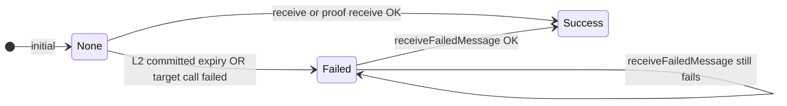
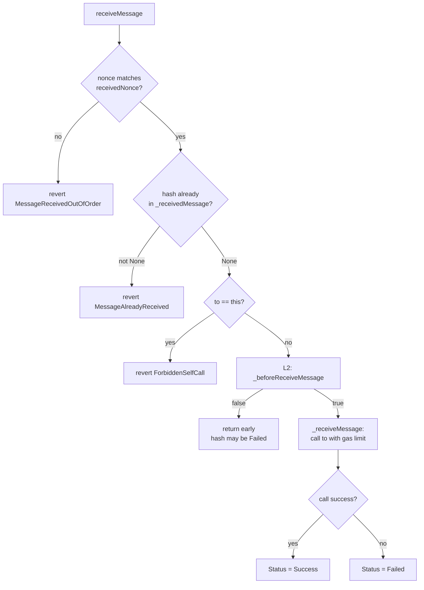
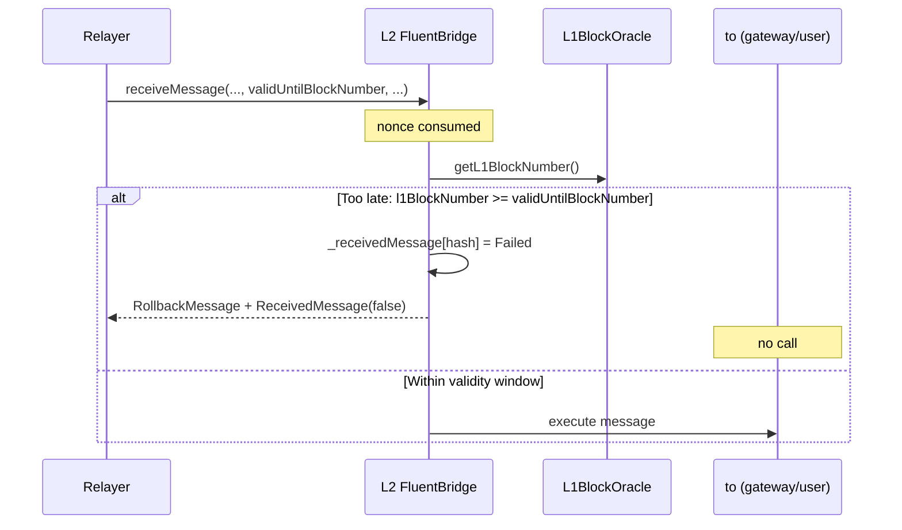
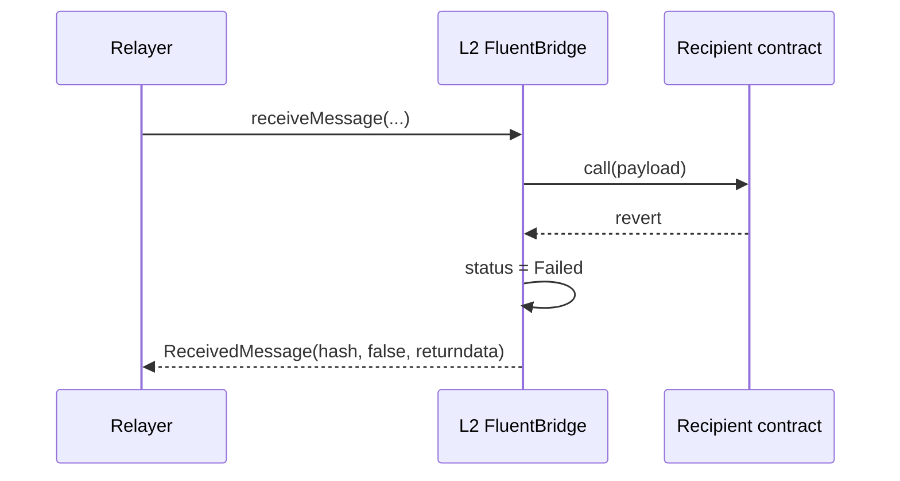
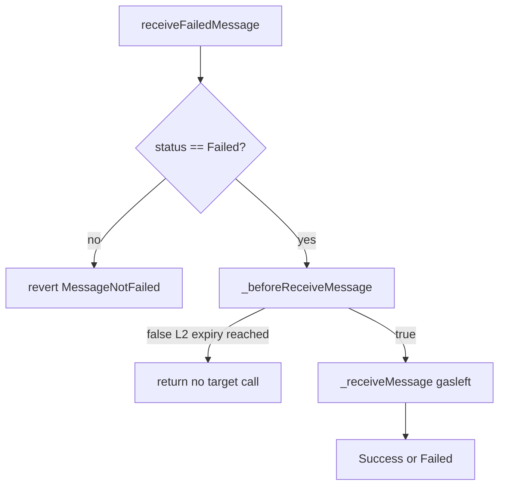
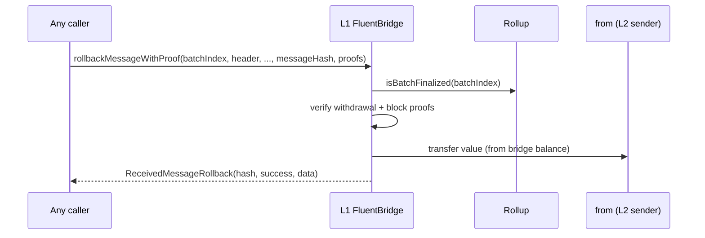

# Bridge failures, rollback, and retries

This document describes how **`FluentBridge`** records failed deliveries, how **L2 timeout (L1→L2)** interacts with the oracle, how **L1 proof rollback** refunds senders, and how **`receiveFailedMessage`** retries execution. It matches the contracts in `contracts/bridge/` unless noted.

---

## 1. Message status model

Each inbound message is keyed by a **`messageHash`**:

`keccak256(abi.encode(from, to, value, chainId, blockNumber, messageNonce, message))`

The bridge stores **`MessageStatus`** per hash in `_receivedMessage`:

| Status | Meaning |
|--------|---------|
| **`None`** | This hash has never been completed as a normal receive (success or failed execution). |
| **`Failed`** | Recorded as failed: either L2 committed-expiry path, or target call reverted / returned failure in `_receiveMessage`. |
| **`Success`** | Target call succeeded. |

**L1-only:** Rollback execution uses a **separate** mapping **`_rollbackMessages`** (not `_receivedMessage`). A successful rollback refund sets rollback status to **`Success`** or **`Failed`** depending on whether the refund call succeeded.

**L1 `rollbackMessageWithProof`:** Refund outcome is stored in **`_rollbackMessages`**, not `_receivedMessage` (see §6).

---

## 2. Trusted delivery: `receiveMessage` (relayer path)

**Who:** `RELAYER_ROLE` only (`FluentBridge.receiveMessage`).

**Ordering:** The relayer must pass **`messageNonce == getReceivedNonce()`** before the call mutates state. The bridge then **`_takeNextReceivedNonce()`** — the nonce is **consumed even if the message is later skipped** (L2 committed-expiry path below).

**Value:** The function is **not payable**. For messages with **`value > 0`**, the bridge pays from its own **pooled balance** (ETH locked by prior `sendMessage` calls). On L2, the chain's consensus layer mints the required native ETH before execution.

**High-level flow:**

**L1 vs L2:** The base implementation of **`_beforeReceiveMessage`** always returns **`true`**. **`L2FluentBridge`** overrides it to enforce the **committed expiry** (next section). **`L1FluentBridge`** does not — L1 relayer receives do not use this timeout hook.

---

## 3. L1 → L2 committed expiry on L2

**Where:** `L2FluentBridge._beforeReceiveMessage`.

**Inputs:** `L1BlockOracle.getL1BlockNumber()` and the committed **`validUntilBlockNumber`** carried in the message hash. That value is snapshotted on L1 as `block.number + receiveMessageDeadline` when the message is sent.

**Condition:** If the message’s committed **`validUntilBlockNumber`** is non-zero and:

`l1BlockNumber >= validUntilBlockNumber`

then the bridge:

1. Sets **`_receivedMessage[messageHash] = Failed`**
2. Emits **`RollbackMessage(messageHash, block.number)`** (L2 block number; used downstream for rollup / withdrawal root wiring)
3. Emits **`ReceivedMessage(messageHash, false, "")`**
4. Returns **`false`** → **`receiveMessage` returns without calling the target** (no mint / no gateway execution)

**Important:** **`receivedNonce` was already incremented** when `receiveMessage` started. The message **does not** stay “pending” in nonce order — that nonce is **spent** on this failed record.

**Operational note:** If the oracle is **stale** or misconfigured, the committed-expiry check is wrong (see `docs/SecurityModel.md`).

---

## 4. Target execution failure (revert or unsafe call failure)

After `_beforeReceiveMessage` returns **`true`**, **`_receiveMessage`** runs **`ExcessivelySafeCall`** to **`to`** with **`getExecuteGasLimit()`** (trusted receive) or **`gasleft()`** (proof receive / retry).

- If the call **succeeds:** **`MessageStatus.Success`**, **`ReceivedMessage(hash, true, data)`**
- If the call **fails:** **`MessageStatus.Failed`**, **`ReceivedMessage(hash, false, data)`**

The **nonce is already consumed** (relayer path). The **same `messageHash`** can be retried only via **`receiveFailedMessage`** (see below).

---

## 5. Retry: `receiveFailedMessage`

**Who:** **Any address** (function is **not payable** and **not** restricted to `RELAYER_ROLE`).

**Precondition:** **`getReceivedMessage(messageHash) == Failed`**. Otherwise **`MessageNotFailed()`**.

**Behavior:**

- `receiveFailedMessage` calls **`_beforeReceiveMessage`** first.
- On L2, **`_beforeReceiveMessage`** performs the committed-expiry check (`l1BlockNumber >= validUntilBlockNumber`).
- If the committed expiry has been reached, **`_beforeReceiveMessage`** writes **`_receivedMessage[messageHash] = Failed`**, emits **`RollbackMessage`** and **`ReceivedMessage(messageHash, false, "")`**, and returns `false`.
- When `_beforeReceiveMessage` returns `false`, **`receiveFailedMessage` returns early** and does not call **`_receiveMessage`**.
- If `_beforeReceiveMessage` returns `true` (committed expiry not reached), `receiveFailedMessage` calls **`_receiveMessage(gasleft(), ...)`**, which executes the target and sets the final message status to **`Success`** or **`Failed`** in **`_receivedMessage`**.

**Value:** The function is **not payable**. For messages with **`value > 0`**, the bridge pays from its own **pooled balance** (same as relayer receive).

**Nonce:** **`receiveFailedMessage` does not increment `receivedNonce`** — it only retries an existing hash.

**L2 committed expiry on retry:** If **`_beforeReceiveMessage`** still sees the message past its committed `validUntilBlockNumber`, it writes **`Failed`**, emits **`RollbackMessage`** and **`ReceivedMessage(false, "")`**, returns **`false`**, and **`receiveFailedMessage` exits** without calling **`_receiveMessage`**. Once the expiry has been reached the message can never be delivered — proceed with `rollbackMessageWithProof` on L1 instead.

---

## 6. L2 → L1 proof rollback: `rollbackMessageWithProof`

**Where:** `L1FluentBridge` only.

**Purpose:** After an L2→L1 message is **included in finalized rollup state**, prove it in the **withdrawal Merkle tree** and **refund the original sender** (`from`) the locked **`value`** from the **L1 bridge balance**. This is the **on-chain refund path** when the message should not (or did not) execute as a normal receive on L1.

**Requirements (simplified):**

- Batch **`batchIndex`** is **finalized** on the rollup (`isBatchFinalized`).
- **`chainId != block.chainid`** (rollback is for **foreign-chain-originated** messages; same-chain IDs are rejected via **`ForbiddenRollbackReceivedMessage`**).
- **`getReceivedMessage(messageHash) == None`** and **`getRollbackMessage(messageHash) == None`** (no double processing).
- Merkle proofs verify **`messageHash`** under the batch’s **`withdrawalRoot`** / block header (see `_verifyWithdrawal`).
- If **`value > 0`**, **`address(this).balance >= value`** or **`InsufficientBridgeBalance`**.

**Execution:** **`msg.value` is not used** for the user refund; funds come from the bridge contract. The refund is a call to **`from`** with **`value`** and empty calldata (gas bound similar to rollback internal path).

**Relation to L2 `RollbackMessage`:** L2 emits **`RollbackMessage`** when a message **times out on delivery**. Operators then build **L2 state** so the message appears under **`withdrawalRoot`**; once the batch is **finalized**, **`rollbackMessageWithProof`** can release **L1-locked** ETH for that message. Exact rollup/proving steps are outside this file.

---

## 7. L2 → L1 success path (contrast): `receiveMessageWithProof`

Not a failure path, but easy to confuse with rollback:

- **`receiveMessageWithProof`** proves the message and **executes `message` against `to`** (mint/unlock path).
- **`rollbackMessageWithProof`** proves the same class of commitment but **refunds `from`** without running the original **`message`** payload on `to`.

Both require a **finalized** batch and valid proofs.

---

## 8. Quick reference: events

| Event | Typical meaning |
|--------|------------------|
| **`ReceivedMessage(hash, true, data)`** | Message execution succeeded. |
| **`ReceivedMessage(hash, false, data)`** | Execution failed, **or** L2 committed-expiry short-circuit (empty data on expiry). |
| **`RollbackMessage(hash, l2Block)`** | L2 marked message as failed because its committed `validUntilBlockNumber` was reached; signals inclusion in withdrawal accounting. |
| **`ReceivedMessageRollback(hash, success, data)`** | L1 **rollback** refund to `from` completed or refund call failed. |

---

## 9. Related code

| Topic | Location |
|--------|----------|
| Core receive / retry | `contracts/bridge/FluentBridge.sol` |
| L2 committed expiry | `contracts/bridge/L2/L2FluentBridge.sol` (`_beforeReceiveMessage`) |
| Proof receive + rollback | `contracts/bridge/L1/L1FluentBridge.sol` |
| Errors / events | `contracts/interfaces/bridge/IFluentBridge.sol` |
| Tests (committed expiry, retry) | `test/Bridge/FluentBridge.t.sol` |
| Roles / trust | `docs/SecurityModel.md` |
