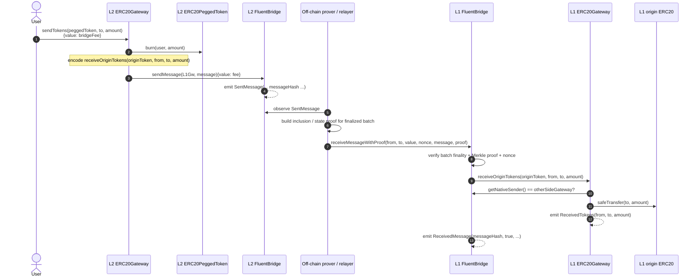
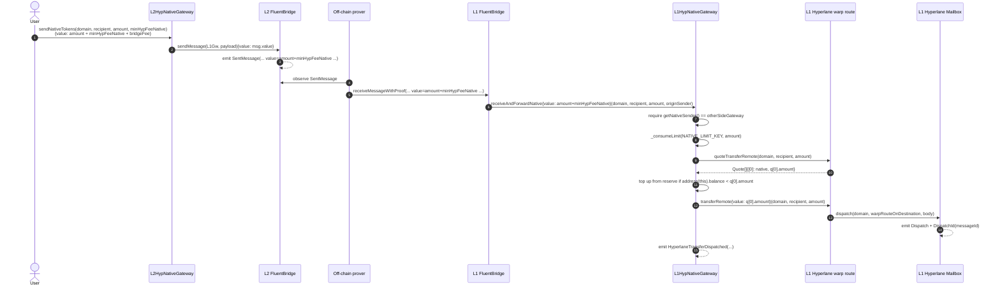
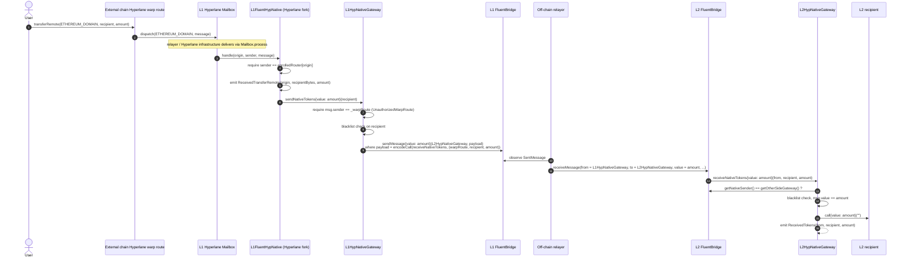

# Gateways

## L2 → L1 ERC20 withdrawal (sequence)

User holds a pegged ERC20 on L2 and withdraws back to its origin token on L1.
Pegged-burn on L2, proof-verified delivery on L1, escrow release to recipient.

### Notes

- **Direction-specific entrypoint.** L2 → L1 uses `L1FluentBridge.receiveMessageWithProof`
  (trust-minimized, proof-gated); the authority-path `receiveMessage` is reserved for L1 → L2.
- **Token mode.** When the user holds a *pegged* token on L2, `sendTokens` takes the burn path
  (`_sendPeggedTokens`) and encodes `receiveOriginTokens`. The mirror case (origin on L2, pegged on L1)
  takes the lock path (`_sendOriginTokens`) and encodes `receivePeggedTokens` — same diagram shape,
  different last leg on L1 (mint instead of `safeTransfer`).
- **Sender check.** `L1 ERC20Gateway` requires `FluentBridge(msg.sender).getNativeSender() == otherSideGateway`,
  i.e. the original L2 sender must be the configured remote gateway.

## Hyperlane Gateway (native ETH)

Bidirectional native ETH bridging between Fluent L2 and any Hyperlane-supported chain in a
single user action. Outbound (Fluent → other chain) and inbound (other chain → Fluent)
travel parallel pipelines through the Hyperlane Mailbox on L1; both directions cross the
L1↔L2 trust boundary via the Fluent rollup bridge.

ERC20 Hyperlane support is deferred (v1 covers native ETH only in both directions).

### Fee model

`msg.value` on the L2 entrypoint is the **exact** sum of three parts:

- `amount` — exact-out value the recipient receives on the destination chain.
- `minHypFeeNative` — pre-funded budget for the live Hyperlane native dispatch fee on L1.
- `bridgeFee` — `FluentBridge.getSentMessageFee()` consumed by cross-bridge delivery.

The bridge transports `amount + minHypFeeNative` to L1 and retains `bridgeFee`. The L1 gateway
re-queries `quoteTransferRemote(domain, recipient, amount)` at delivery; if the live
`quotes[0].amount` exceeds the bridge-transported value, the gateway tops up from its
admin-funded native reserve. If the reserve is insufficient the receive reverts and the bridge
marks the message `Failed`, retryable via `receiveFailedMessage` after the admin tops up.

### Cross-trust-boundary policy

The L1 gateway applies the same `_consumeLimit` rate cap as `NativeGateway`, charged against
the **shared** `NativeGateway.NATIVE_LIMIT_KEY` bucket on `FastWithdrawalList`. While the
originating L1 batch is in `BatchStatus.Preconfirmed`, the rate cap bounds optimistic forward
dispatch; once `Finalized` the cap is a no-op.

The shared key is mandatory: a separate bucket would let an attacker drain twice the cap by
exploiting `NativeGateway` and `L1HypNativeGateway` in parallel within one optimistic window.
Underlying safety at `Preconfirmed` comes from the Nitro proof verification that this batch
status represents — the rate cap is defense-in-depth on top of that, bounding blast radius
in the rare event a verified batch is later challenged successfully.

### Sequence (native, outbound)

### Domain & recipient encoding

- `domain` is `uint32` — Hyperlane's own ID, **NOT** EVM `chainId`. Examples:
  `optimism=10`, `arbitrum=42161`, `base=8453`, `solanamainnet=1399811149`.
- `recipient` is `bytes32`. EVM destinations: `bytes32(uint256(uint160(addr)))` (left-padded).
  Solana: 32-byte ed25519 public key directly.
- The contract checks only `recipient != bytes32(0)`; remaining format validation is the UI's
  responsibility — Hyperlane's destination router decodes whatever bytes32 it receives.

### Indexer integration

The L1 gateway emits `HyperlaneTransferDispatched(domain, recipient, amount, originSender)`.
The Hyperlane `messageId` is **not** captured on-chain — `ITokenBridge.transferRemote` is
`returns ()` in v10. Indexers correlate via the Mailbox `DispatchId(bytes32)` event from the
same tx hash (filtered by sender = our gateway address), then query the Hyperlane GraphQL API
for delivery status on the destination chain.

### Operational runbook: native reserve top-up

The L1 gateway holds an admin-prefunded ETH reserve (~0.5 ETH per supported domain) used to
cover live `quoteTransferRemote` overruns. Off-chain monitoring should alert when the gateway
balance drops below 30% of the operating buffer. Top-up: send ETH directly to the gateway
address (the contract has a bare `receive()` that accepts ETH from any source). Sweep
overpayment refunds via `rescueNative(to, amount)` (admin-only).

### Sequence (native, inbound)

External chain → Fluent L2 transfer. The originating chain dispatches via its Hyperlane
warp route; on Ethereum the message lands at `L1FluentHypNative` (a custom warp-route
extension that lives in [fluentlabs/hyperlane-monorepo](https://github.com/fluentlabs/hyperlane-monorepo)
under `solidity/contracts/token/extensions/`, inheriting stock `HypNative` and overriding
`_handle`). The warp route forwards via `L1HypNativeGateway.sendNativeTokens` — the same
Fluent-side L1 gateway used by the outbound path — which dispatches a bridge message to
`L2HypNativeGateway.receiveNativeTokens` on Fluent. Symmetric to `NativeGateway` end to end.

### Warp-route auth and cross-trust-boundary policy

`L1HypNativeGateway` keeps a single `_warpRoute` field (ERC-7201 namespaced storage, admin-set
via `setWarpRoute(address)`). The same address serves both directions:

- **Outbound** (L2→external, `receiveAndForwardNative`): the contract on which
  `transferRemote` is called.
- **Inbound** (external→L2, `sendNativeTokens`): the `msg.sender` allowed to forward inbound
  Hyperlane deliveries. Reverts with `UnauthorizedWarpRoute` if any other caller invokes it,
  or `UnauthorizedWarpRoute` again if the warp route hasn't been set yet (defaults to
  `address(0)`, no caller can match).

`L2HypNativeGateway.receiveNativeTokens` follows the standard `NativeGateway` shape:
bridge-only, peer-auth via `FluentBridge.getNativeSender() == getOtherSideGateway()` (single
L1 peer = `L1HypNativeGateway` for both directions), `msg.value == amount`, blacklist on the
recipient (defense-in-depth on the L2 hop since the originating sender on a Hyperlane source
chain is outside Fluent's blacklist scope), then `call{value}("")` to deliver, then
`ReceivedTokens(from, to, amount)` event from `IGatewayBaseEvents`.

No `_consumeLimit` rate cap on the L2 inbound path: `_isFromPreconfirmedBatch()` is
structurally always false on L2 (the L2 bridge has no transient batch index), so the gate
would be a no-op. Trust comes from Hyperlane's ISM verification plus the `FluentBridge`
proof — two independent layers. Admin controls (pause, rate-limit, custom blacklist on the
L1 hop) can be added to `L1HypNativeGateway.sendNativeTokens` via UUPS upgrade without
touching the Hyperlane fork.

### Revert-and-retry recovery contract

If any step in the inbound chain reverts — `L1HypNativeGateway.sendNativeTokens` rejects
(blacklist hit, bridge paused, destination de-whitelisted, bridge balance check), or its
downstream `FluentBridge.sendMessage` reverts — `_handle` reverts, `Mailbox.process` rolls
back `deliveries[messageId]` atomically, and the Hyperlane message stays retryable via
permissionless `Mailbox.process(_metadata, _message)` once the failure clears. There is no
quarantine bucket by design — matches every other Hyperlane warp-route extension upstream
(`HypNative`, `OPL2ToL1*`, `TokenBridgeCctpBase`, `EverclearTokenBridge`).

Operational implication: off-chain monitoring should alert on stale undelivered Hyperlane
messages targeting `L1FluentHypNative` so ops can investigate and either fix the L1 side
or manually invoke `Mailbox.process` with the original delivery proof.

### Deployment order (inbound)

`L1FluentHypNative` is deployed from the Hyperlane fork via Hyperlane's standard
warp-route deploy infrastructure (not via this repo's `scripts/deploy/`). Post-deploy
cross-system steps:

1. Deploy `L1FluentHypNative` from the Hyperlane fork → record proxy address. Constructor
   takes the existing `L1HypNativeGateway` proxy address (single immutable downstream
   target).
2. **Whitelist `L2HypNativeGateway` on L1 FluentBridge**: from L1 admin, call
   `L1FluentBridge.registerGateway(L2HypNativeGatewayAddr)`. Without this every inbound
   delivery reverts with `GatewayNotWhitelisted` — most likely deployment-day failure mode.
3. Enroll remote Hyperlane peers: `L1FluentHypNative.enrollRemoteRouter(domain, peer)` per
   supported remote chain. The remote side also enrolls `(ETHEREUM_DOMAIN,
   L1FluentHypNativeAddr)` on its own warp route.
4. Configure the warp route on the Fluent gateway:
   `L1HypNativeGateway.setWarpRoute(L1FluentHypNativeAddr)` from L1 admin. This single
   admin call wires BOTH outbound dispatch and inbound caller-auth.
