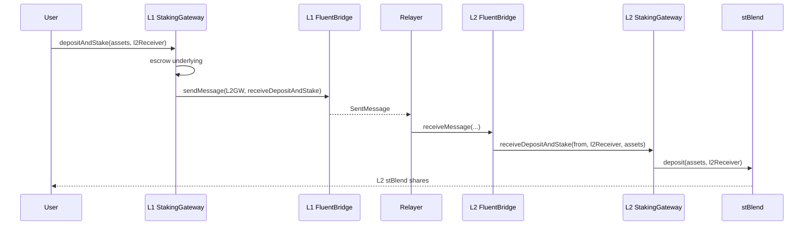
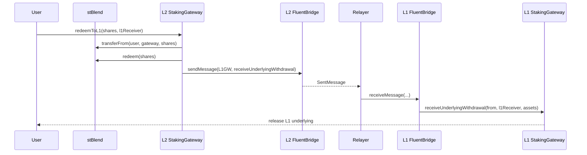
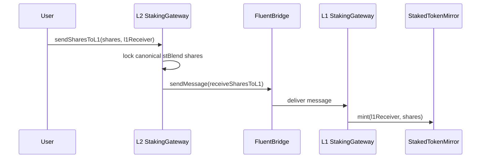
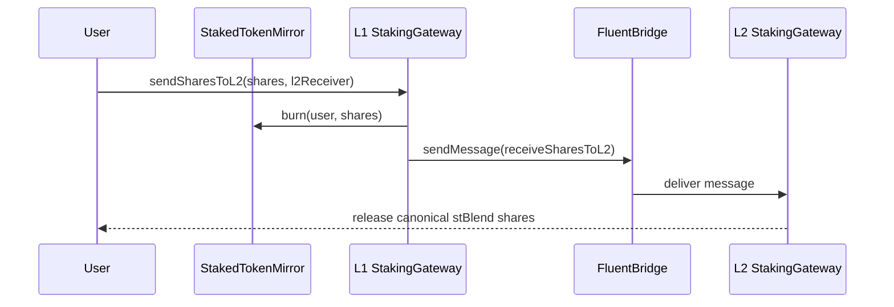

# Omni Liquid Staking

## Overview

Omni liquid staking uses the native `FluentBridge` with a dedicated `StakingGateway`.

The design is **L1 source / L2 canonical**:

- **L1** holds the source underlying token and the mirror share token (`StakedTokenMirror`).
- **L2** holds the canonical ERC-4626 vault (`stBlend`) where deposits, withdrawals, and yield accounting happen.
- **Yield is accounted only on L2** through the `stBlend` share price. L1 mirror shares are only a bridged representation of L2 vault shares.

## Contracts

| Contract | Chain | Purpose |
|----------|-------|---------|
| `stBlend` | L2 | Canonical ERC-4626 vault. Streams external rewards into share price. |
| `StakingGateway` | L1 | Escrows underlying, releases withdrawals, mints/burns mirror shares. |
| `StakingGateway` | L2 | Deposits L2 inventory into `stBlend`, redeems shares, locks/releases canonical shares. |
| `StakedTokenMirror` | L1 | Mirror representation of canonical L2 `stBlend` shares. |
| `FluentBridge` | L1/L2 | Native message transport between gateways. |

## L1 to L2 Deposit and Stake

User starts on L1 with the underlying token. The L1 gateway escrows the asset and sends a bridge message. The L2 gateway uses its local inventory to deposit into the canonical vault and mint `stBlend` shares to the L2 receiver.

## L2 to L1 Redeem and Withdraw

User starts on L2 with canonical `stBlend` shares. The L2 gateway pulls and redeems the shares into underlying inventory, then sends a bridge message. The L1 gateway releases escrowed underlying to the L1 receiver.

## Native Share Bridging

The gateway also supports moving the staking position itself across chains.

When moving shares from L2 to L1, canonical `stBlend` shares are locked in the L2 gateway and mirror shares are minted on L1.

When moving shares back from L1 to L2, mirror shares are burned and the locked canonical shares are released on L2.

## Key Notes

- This share movement is implemented directly over the native bridge, not through an external cross-chain token standard.
- `stBlend` is the only source of truth for yield and share price.
- The L1 mirror token does not accrue yield by itself; its economic value follows the canonical L2 share it represents.
- Cross-chain deposit/withdrawal depends on L2 gateway inventory for L1-to-L2 staking and L1 gateway escrow for L2-to-L1 withdrawals.
- Gateway configuration (`otherSideGateway`, bridge address, vault, mirror token, limits) is a high-trust operational surface and should be multisig-controlled.
